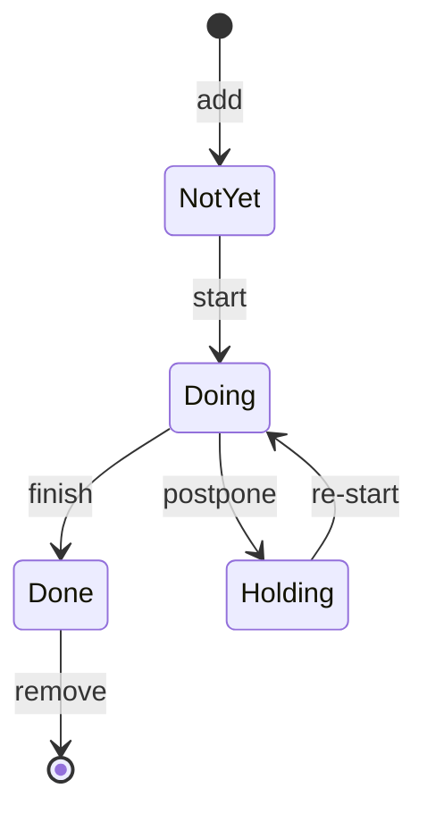

# ToDo List

This is a simple todo-list project written in Rust.

## Goals of This Project

- [ ] implement in/out prompt
- [ ] add a task
- [ ] make a task status done/doing/yet
- [ ] update a task
- [ ] delete a task (not complete)
- [ ] see all tasks and status
- [ ] preserve all tasks in csv/database file
- [ ] postpone a task tomorrow

## status of task

